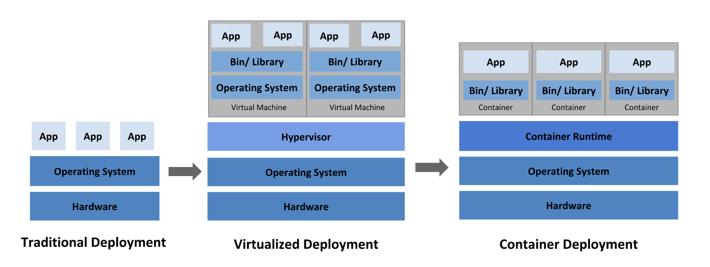
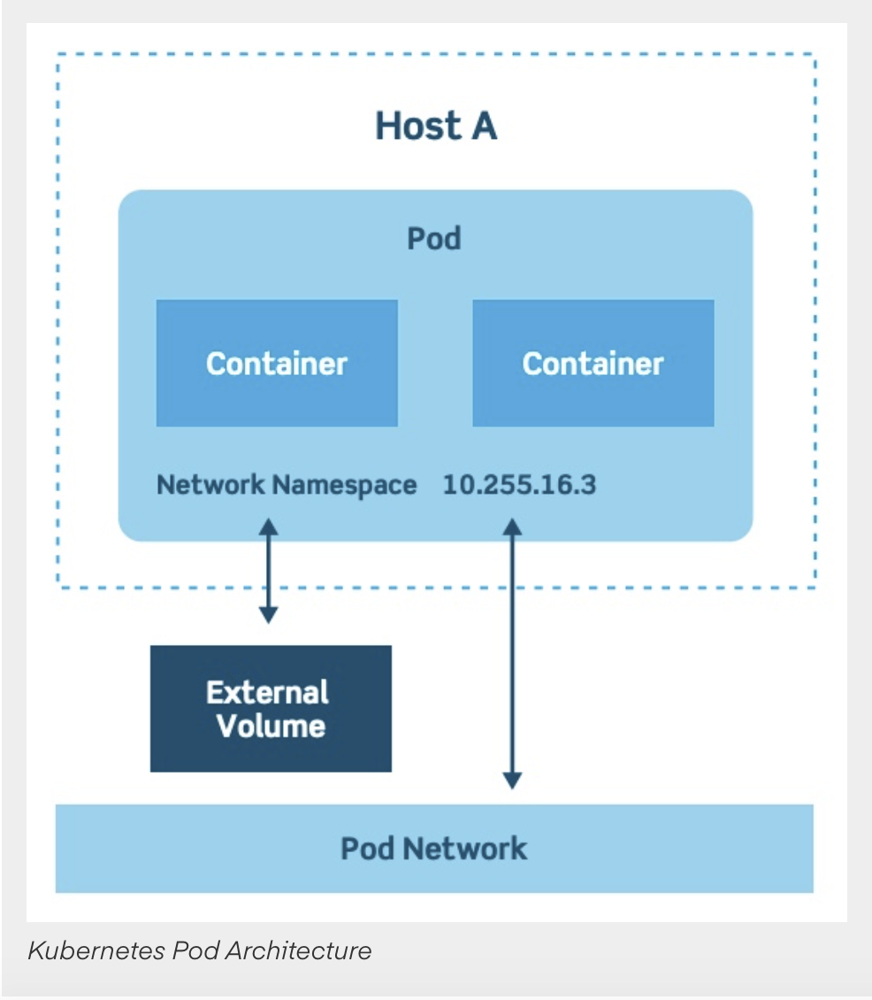
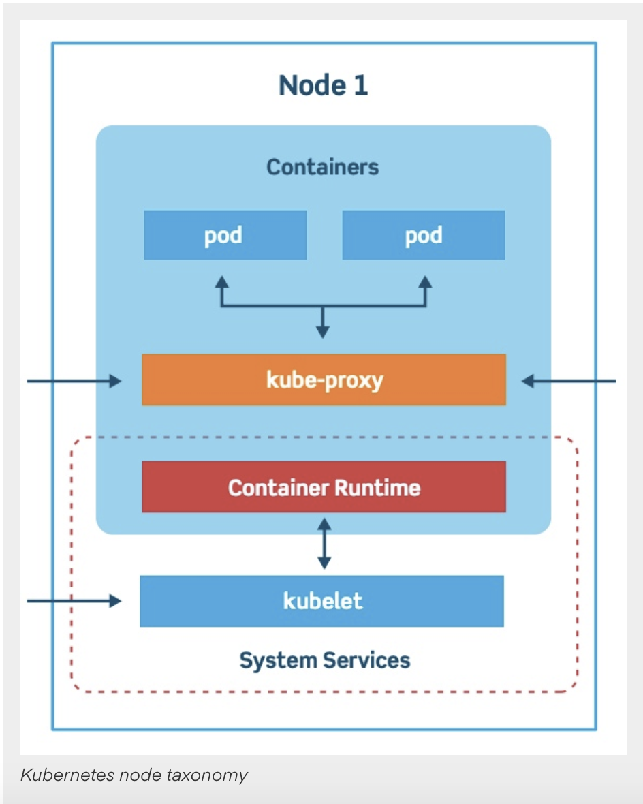
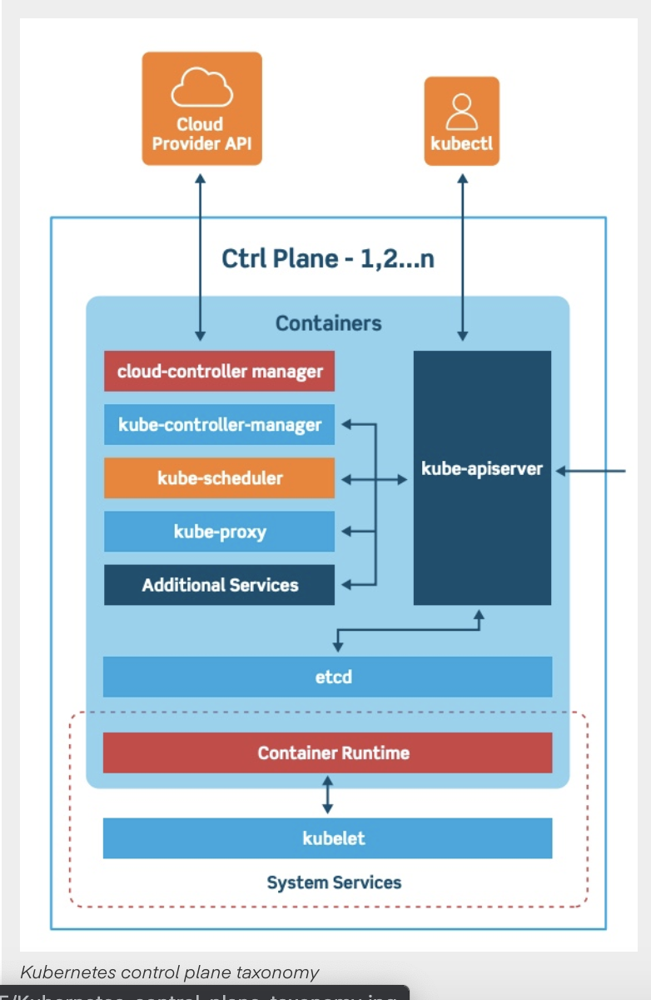
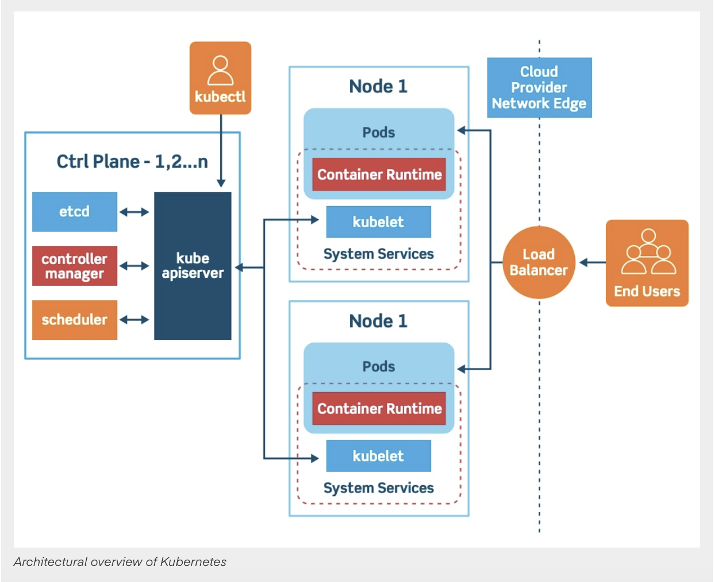
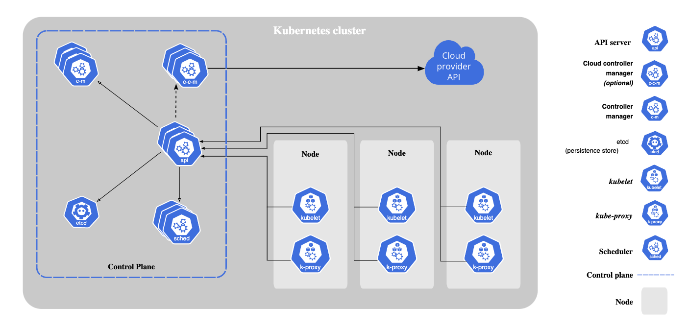

# Intro To Kubernetes
    portable, extensible, open-source platform for managing containerized workloads and services, that facilitates both declarative configuration and automation.

## Deployment Generation
    * Nomadic era
    * VM era
    * Container era

**Deployment History**

## Components

* **Pods And Services**
    * It's a group of one or more containers.
    * Pods are ephemeral, with a limited lifespan. When scaling back down  or upgrading to a new version, for instance, pods eventually die.
    * Pods are responsible for horizontal autoscaling.
    * Help in performing rolling updates.
    * Architecture 

* **Cluster Nodes** 
    * Worker machines that runs pods.
    * Managed by master nodes.
    * Kubelet - primary and most important controller.
    * Drives container execution layer.
    * Architecture 

* **Control Plane**
    * Maintains a record of all Kubernetes objects. It helps in managing object states, responding to changes in the cluster; it also works to make the actual state of system objects match the desired state.
    *  Made up of three major components:
        1. kube-apiserver - API server for front end. kube-apiserver is designed to scale horizontally that is,
        it scales by deploying more instances. You can run several instances of kube-apiserver and balance traffic
        between those instances.
        2. kube-controller-manager - it watches the shared state of the cluster through api-server and update it's state to desired state.
        all controller have it's own state. but to reduce complexity it's been compiled into one and run as separate processes. controller 
        includes following processes:
            * Node controller
            * Replication controller
            * Endpoints controller
            * Service Account & Token controllers
        3. kube-scheduler - Watches for newly created Pods with no assigned node, and selects a node for them to run on.
        Factors taken into account for scheduling decisions include: individual and collective resource requirements, hardware/software/policy constraints, data locality, inter-workload interference, and deadlines.
    * Architecture 

* **Cluster Architecture**
    * From a high level, a Kubernetes environment consists of a control plane (master), a distributed storage system for keeping the cluster state consistent (etcd - high available key value storage used for backing up cluster state variables), and a number of cluster nodes (Kubelets - service runs inside each node responsible for managing pods/containers too.).
    * Architecture 

**Basic Structure**

